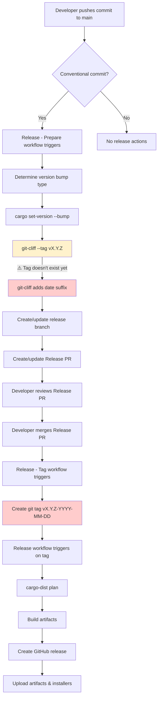

# Cargo Dist Explore

Test project for exploring cargo-dist release automation.

## Release Workflow

### Current Issue

The workflow creates **date-suffixed release versions** (e.g., `v3.7.0-2025-09-28`) because:

1. **Step G**: `git-cliff --tag "vX.Y.Z"` is called with a tag that doesn't exist yet
2. **Step H**: git-cliff automatically appends the current date to make the tag unique
3. **Step N**: The tag gets created with the date suffix
4. **Steps O-S**: cargo-dist uses the date-suffixed tag for the release

The tag creation happens **after** the changelog generation, causing this timing issue.
